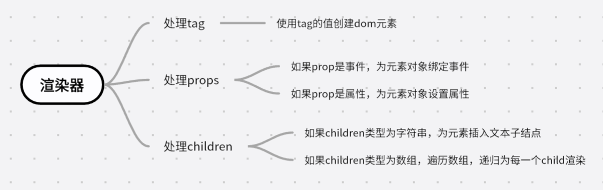
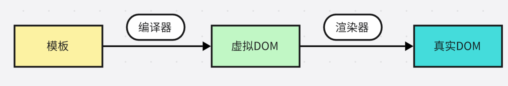

# 设计思路

## 声明式描述UI

VUE3中声明式描述的解决方案

-   使用与HTML标签一致的方式描述DOM元素，例如`<div></div>`
-   使用与HTML标签一致的方式描述属性，例如`<div id="box"></div>`
-   使用`:`或`v-bind`来描述动态绑定的属性，例如`<div :id="id"></div>`
-   使用`@`或`v-on`来描述事件，例如`<div @click="onclick"></div>`
-   使用与HTML一致的方式来描述层级结构，例如`<div><span></span></div>`

除了使用上述**模板**的方式声明式描述UI，还可以通过JavaScript对象来描述，如下

```js
const title = {
    tag: "h1",
    props: {
        onClick: handler,
    },
    children: [{ tag: "span" }],
}
```

对应的模板就是

```html
<h1 @click="handler">
    <span> </span>
</h1>
```

对象较模板而言更加灵活，我们可以使用变量动态更新对象中的参数:

```js
let level = 3
const title = {
    tag: `h${level}`,
}
```

当`level`的数值发生变化时，如果使用模板来描述就不得不穷举

```html
<div v-if="level === 1"></div>
<div v-else-if="level === 2"></div>
//...
```

实际上，使用JavaScript对象来描述UI的方式，就是所谓的**虚拟DOM**。
在vue.js中`h`函数能够创建一个虚拟DOM对象，用该函数就能够实现手写渲染函数`render`

```js
import { h } from "vue"

export default {
    render() {
        return h("h1", { onClick: handler })
    },
}
```

这个函数的返回值就是一个对象，实际上它等价于下面的代码。使用函数的方式能够更加方便我们编写虚拟DOM。

```js
export default {
    render() {
        return {
            tag: "h1",
            props: {
                onClick: handler,
            },
        }
    },
}
```

## 渲染器

渲染器的作用就是将虚拟DOM对象渲染为真实的DOM，例如有以下虚拟DOM

```js
const vnode = {
    tag: "div",
    props: {
        onClick: () => alert("hello"),
    },
    children: "click me",
}
```

我们可以根据虚拟DOM的设计分析渲染器应该如何实现



根据上述流程，我们可以为虚拟DOM实现一个渲染器函数`renderer(vnode: Vnode, container: HTMLElement)`
其作用是将虚拟DOM节点`vnode`挂载到真实DOM元素`container`上。

```js
function renderer(vnode, container) {
    // 根据tag创建标签元素
    const el = document.createElement(vnode.tag)

    // 根据props为元素绑定属性和事件

    for (const [propName, propValue] of vnode.props) {
        if (/^on/.test(propName)) {
            const eventName = propName.splice(0, 2).toLowerCase()
            el.addEventListener(eventName, propValue)
        } else {
            el.setAttribute(propName, propValue)
        }
    }

    // 根据children为元素设置子节点
    if (typeof vnode.children === "string") {
        const text = createTextNode(vnode.children)
        el.appendChild(text)
    } else if (Array.isArray(vnode.children)) {
        vnode.children.forEach((child) => renderer(child, el))
    }

    // 将渲染好的节点挂载到对应的元素上
    container.appendChild(el)
}
```

## 组件的本质

实际上，组件的本质就是**一组DOM元素的封装**。因此，组件在JavaScript层面上就是封装好的一组对象。在这个基础上，我们可以使用一个函数来封装组件

```js
const MyComponent = function () {
    return {
        tag: "div",
        props: {
            onClick: () => alert("hello"),
        },
        children: "click me",
    }
}
```

我们可以定义虚拟DOM来描述组件了。

```js
const vnode = {
    tag: MyComponent,
}
```

上一节中的虚拟DOM的`tag`为原生的HTML元素的字符串，与其不同的是，在这里我们使用函数来表示封装好的组件。为了能够支持
组件的渲染，我们需要对渲染器进行一定的修改以支持组件的渲染。

```js
function renderer(vnode, container) {
    if (typeof vnode.tag === "string") {
        mountElement(vnode, container)
    } else if (typeof vnode.tag === "function") {
        mountComponent(vnode, container)
    }
}

function mountElement(vnode, container) {
    // 根据tag创建标签元素
    const el = document.createElement(vnode.tag)

    // 根据props为元素绑定属性和事件

    for (const [propName, propValue] of vnode.props) {
        if (/^on/.test(propName)) {
            const eventName = propName.splice(0, 2).toLowerCase()
            el.addEventListener(eventName, propValue)
        } else {
            el.setAttribute(propName, propValue)
        }
    }

    // 根据children为元素设置子节点
    if (typeof vnode.children === "string") {
        const text = createTextNode(vnode.children)
        el.appendChild(text)
    } else if (Array.isArray(vnode.children)) {
        vnode.children.forEach((child) => renderer(child, el))
    }

    // 将渲染好的节点挂载到对应的元素上
    container.appendChild(el)
}

function mountComponent(vnode, container) {
    const subtree = vnode.tag()
    // 调用渲染器，注意在组件中可能仍然含有组件
    renderer(subtree, container)
}
```

同样，组件也可以使用对象来进行封装

```js
const MyComponent = {
    render() {
        return {
            tag: "div",
            props: {
                onClick: () => alert("hello"),
            },
            children: "click me",
        }
    },
}
```

在`renderer`和`mountComponent`中改变相应的判断方式即可

```js
function renderer(vnode, container) {
    if (typeof vnode.tag === "string") {
        mountElement(vnode, container)
    } else if (typeof vnode.tag === "object") {
        mountComponent(vnode, container)
    }
}

function mountComponent(vnode, container) {
    const subtree = vnode.tag.render()
    renderer(subtree, container)
}
```

## 模板的工作原理

编译器的作用就是将模板编译成渲染函数，即虚拟DOM



例如给出如下模板

```html
<div @click="handler">click me</div>
```

编译器会解析模板中的字符串，并将其转换为一个与之功能相同的渲染函数

```js
import { h } from 'vue'
render(){
    return h('div', {onClick: handler}, 'click me')
}
```

在给出一个单文件组件的例子

```vue
<template>
    <div @click="handler">click me</div>
</template>

<script>
export default {
    data() {},
    methods() {
        handler: () => {}
    },
}
</script>
```

编译器会把模板内容编译成渲染函数，**并添加到script标签块的组件对象上**，最终浏览器将要
运行的代码如下

```js
export default {
    data() {},
    methods() {
        handler: () => {}
    },
    render() {
        return h("div", { onClick: handler }, "click me")
    },
}
```

无论是模板还是手写的渲染函数，浏览器最终要渲染的内容都是通过渲染函数`render`产生的，
然后渲染器再将渲染函数返回的虚拟DOM渲染为真实DOM，这是模板的工作原理，也是vue.js渲染页面的流程
