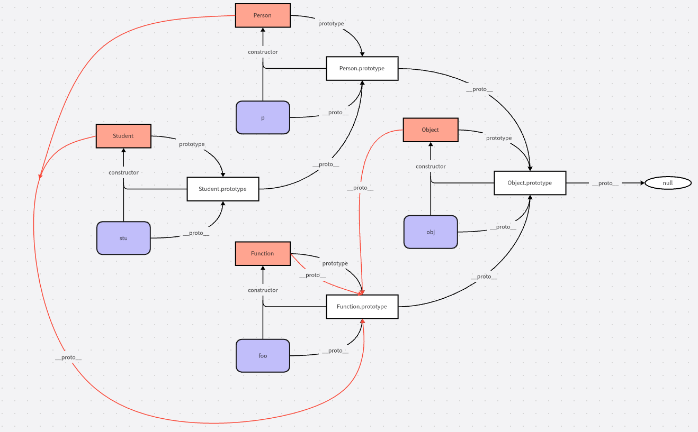

# 对象

## 对象的属性

对象的属性分为两种

-   数据属性
-   访问器属性

ECMA-262使用一些内部属性来描述属性的特征，这些特征不能直接被开发者在Javascript访问到。
通常使用两个中括号把特性名称包裹起来。

上述的两种对象属性具有不完全相同的属性特征。

### 数据属性

数据属性是通常的对象属性，包含一个保存数据值的位置（引用），值从该位置读取，写入时也会写到该位置。
有四个特征描述数据属性的行为

-   **[[Configurable]]**: 表示属性是否可以通过`delete`关键字删除并重新定义、是否可以修改它的特性以及是否可以改造为访问器属性
-   **[[Enumerable]]**: 表示属性是否可以通过`for...in`和`Object.keys()`返回；直接打印该对象也无法看到其值。当`enumerable`为`false`时，`object.hasOwnProperty(key)`和`key in object`能正常返回`true`，不受该特性的影响
-   **[[Writable]]**: 表示属性是否可以被修改（是否可写），当`writable`为`false`时，对该属性的值进行修改会被忽略
-   **[[Value]]**: 包含属性实际的值，默认值为`undefined`

所有显式地定义的属性，其[[Configurable]], [[Enumerable]]和[[Writable]]都为`true`。

通过`Object.defineProperty(object, propertyName, config)`方法可以为属性显式地设置上述特征，如果在`config`中不对上述特征进行显式地设置，默认情况下通过该方法定义的属性其三个特征都为`false`

```js
const person = {}

Object.defineProperty(person, "name", {
    configurable: false,
    enumerable: false,
    writable: false,
    value: "John",
})

// 测试configurable
console.log(person) // {}
console.log(person.name) // John
delete person.name
console.log(person.name) // John

// 测试 enumerable
console.log(Object.keys(person)) // []
console.log("name" in person) // true

// 测试 writable
person.name = "Lily"
console.log(person.name) // John
```

在严格模式下，删除`configurable`为`false`的属性或修改`writable`为`false`的属性会抛出`TypeError`错误。

同时，一个属性的`configurable`一旦设置为`false`，就不能再使用`Object.defineProperty()`对其进行任何配置，否则也会抛出错误。

### 访问器属性 {#accessor}

访问器属性不包含数据值，他们会有一个getter函数和一个setter函数，这两个函数也不是必须的。读取访问器属性时，会调用getter，其职责就是返回一个有效的值；写入访问器属性是，会调用setter，其职责是根据写入的数据对某些数据进行修改。同样，访问器属性有四个特征

-   **[[Configurable]]**: 表示属性是否可以通过`delete`关键字删除并重新定义、是否可以修改它的特性以及是否可以改造为访问器属性
-   **[[Enumerable]]**: 表示属性是否可以通过`for...in`和`Object.keys()`返回；直接打印该对象也无法看到其值。当`enumerable`为`false`时，`object.hasOwnProperty(key)`和`key in object`能正常返回`true`，不受该特性的影响
-   **[[get]]**: 在读取属性时调用，默认值为`undefined`
-   **[[set]]**: 在写入属性时调用，默认值为`undefined`
-

访问器属性只能通过`Object.defineProperty()`进行定义。访问器属性的一个典型应用场景为在`setter`中根据设置的值导致一些其它变化的产生。它也是`Vue2`中响应式数据的实现原理。

```js
const book = {
    year_: 2017,
    edition: 1,
}

Object.defineProperty(book, "year", {
    get() {
        return this.year_
    },
    set(value) {
        if (value > 2017) {
            this.year_ = value
            this.edition += value - 2017
        }
    },
})

book.year = 2018
console.log(book.edition) // 2
```

### 定义多个属性 {#multiproperties}

使用`Object.defineProperties(object, config)`可以一次性定义多个属性，其使用方法如下

```js
const book = {}

Object.defineProperties(book, {
    year_: {
        value: 2017,
    },
    edition: {
        value: 1,
    },
    year: {
        get() {
            return this.year_
        },
        set(value) {
            if (value > 2017) {
                ;(this.year_ = value), (this.edition += value - 2017)
            }
        },
    },
})
```

### 读取属性的特性

使用`Object.getOwnPropertyDescriptor(object, propertyName)`可以获取属性`propertyName`的特性。

参考[上一小节](#multiproperties)中的代码，获取其特性如下

```js
const descYear_ = Object.getOwnPropertyDescriptor(book, "year_")
console.log(descYear_)
// {
//   value: 2017,
//   writable: false,
//   enumerable: false,
//   configurable: false
// }
const descYear = Object.getOwnPropertyDescriptor(book, "year")
console.log(descYear)
// {
//   get: [Function: get],
//   set: [Function: set],
//   enumerable: false,
//   configurable: false
// }
```

使用ES 2017新增的`Object.getOwnPropertyDescriptors(object)`可以一次性返回所有属性的特性。

```js
const decriptors = Object.getOwnPropertyDescriptors(book)
console.log(decriptors)
// {
//   year_: {
//     value: 2017,
//     writable: false,
//     enumerable: false,
//     configurable: false
//   },
//   edition: { value: 1, writable: false, enumerable: false, configurable: false },
//   year: {
//     get: [Function: get],
//     set: [Function: set],
//     enumerable: false,
//     configurable: false
//   }
// }
```

### 合并对象 {#Object-assign}

使用`Object.assign(target, ...sources)`可以进行对象属性的合并。合并的过程如下

-   获取对象中`hasOwnProperty(key)`和`propertyIsEnumerable(key)`为`true`的属性
-   对每一个属性，**调用源对象上的[[Get]]方法获取属性值**
-   **使用目标对象的[[Set]]设置属性值**

该方法有以下几个特点：

-   浅拷贝，引用对象会相同
-   **抛出错误不会回滚，已经合并的值不会消失**

### 对象标识 {#Object-is}

使用`Object.is()`方法能够正确处理±0以及`NaN`的相等判断，较`===`号更能满足我们的预期。

```js
const arr = [
    Object.is(true, 1), //false
    Object.is({}, {}), //false
    Object.is("2", 2), //false
    Object.is(+0, -0), //false
    Object.is(+0, 0), // true
    Object.is(0, -0), //false
    Object.is(NaN, NaN), // true
]

for (let res of arr) {
    console.log(res)
}
```

要判断多个值是否相等，可以使用[递归的形式](/_questions/js/对象.md#判断两个值相等)

### 增强对象语法

#### 属性值简写

```js
const name = "Matt"

const person {
    name
}

console.log(person) // {name: "Matt"}
```

#### 可计算属性

```js
const nameKey = "name"
const ageKey = "age"

const person = {
    [nameKey]: "Matt",
    [ageKey]: 15,
}

console.log(person) // {name: "Matt", age: 15}
```

计算属性本身可以是复杂表达式

```js
let id = 0
const nameKey = "name"
const getNameKey = (keyVar) => {
    return `${keyVar}_${id++}`
}

const personA = {
    [getNameKey(nameKey)]: "Matt",
}

const personB = {
    [getNameKey(nameKey)]: "John",
}

console.log(personA) // { name_0: "Matt" }
console.log(personB) // { name_1: "John" }
```

::: info 注意
计算属性表达式中抛出的任何错误都会终止对象的创建，如果计算属性表达式有**副作用**，而且又抛出了错误，那么之前完成的计算是不能够回滚的。
:::

#### 简写方法名

```js
const person = {
    sayHello() {
        console.log("Hello")
    },
}
person.sayHello() // Hello
```

简写方法名同样适用于`getter`和`setter`

```js
const person = {
    name_: "John",
    get name() {
        return this.name_
    },
    set name(name) {
        console.log(`Name is set as ${name}`)
        this.name_ = name
    },
    sayHi() {
        console.log(`Hi, I am ${this.name_}`)
    },
}
person.sayHi() // Hi, I am John
person.name = "Matt" // Name is set as Matt
person.sayHi() // Hi, I am Matt
```

### 对象解构

详见[ES6解构](/frontend/js/es6/基础特性.md#destructing)

## 创建对象

巧妙使用原型继承，能够成功模拟类以及继承等面向对象变成行为

### 工厂模式

```js
function createPerson(name, age) {
    let obj = new Object()
    obj.name = name
    obj.age = age
    obj.sayHi = function () {
        console.log(`Hi, I am ${this.name}`)
    }
    return obj
}

const person = createPerson("Matt", 15)
```

该模式没有解决创建的对象到底拥有什么类型的问题。

### 构造函数模式

```js
function Person(name, age) {
    this.name = name
    this.age = age
    this.sayHi = function () {
        console.log(`Hi, I am ${this.name}`)
    }
}

const personA = new Person("Matt", 15)
const personB = new Person("John", 18)

personA.sayHi() //Hi, I am Matt
personB.sayHi() //Hi, I am John
```

使用`new`操作符执行构造函数与工厂模式有如下区别：

-   没有显式创建对象
-   属性和方法赋值给了`this`
-   没有`return`

`new`操作符调用构造函数会执行以下操作：

-   在内存中创建一个对象
-   这个新对象的[[Prototype]]特性被赋值为构造函数的`prototype`属性
-   构造函数内部的`this`被赋值为这个新对象，即`this`指向新对象
-   执行构造函数内的代码
-   如果构造函数返回非空对象，返回该对象，否则返回刚新创建的对象

创建出来的实例存在一个`constructor`属性指向构造函数。

```js
console.log(personA.constructor === Person) // true
console.log(personB.constructor === Person) // true
```

通常我们使用`instanceof`关键字来判断一个对象是不是某一个构造函数的实例，`instanceof`能够追溯到原型链上所有的构造函数。

```js
console.log(personA instanceof Object) // true
console.log(personA instanceof Person) // true
```

相比于工厂模式，`personA`和`personB`也会被认为是`Object`的实例，原因是所有的自定义的对象和构造方法都继承自`Object`。

#### 构造函数也是函数

构造函数作为普通函数调用时，结果会将构造函数中的所有属性添加到全局对象`window`下（浏览器中，node环境中为`globalThis`）

```js
//node 环境
Person("Matt", 15)
globalThis.sayHi() // Hi, I am Matt
```

使用`call`或者`apply`方法能够改变`this`指向

```js
const person = new Object()
Person.call(person, "John", 18)
person.sayHi()
console.log(person instanceof Person) // false
console.log(person.constructor) // [Function: Object]
```

#### 构造函数存在的问题

多个实例对象之间不共享函数

```js
console.log(personA.sayHi === personB.sayHi) // false
```

### 原型模式

#### 原型的概念

无论何时，只要创建函数，就会按照**特定的规则**为这个函数创建一个`[[prototype]]`属性（指向**原型对象**）。默认情况所有原型对象自动获得一个`constructor`属性，指回与之关联的构造函数。

```js
function Person(name, age) {
    this.name = name
    this.age = age
    this.sayHi = function () {
        console.log(`Hi, I am ${this.name}`)
    }
}

console.log(Person.prototype.constructor === Person) // true
```

正常的原型链会终止与Object，Object原型的原型是`null`

```js
console.log(Person.prototype.__proto__ === Object.prototype) // true
console.log(Person.prototype.__proto__.constructor === Object) // true
console.log(Person.prototype.__proto__.__proto__) // null
```

每创建一个新的实例，实例内部的`[[prototype]]`指针会指向构造函数的原型对象.实例没有显式的`prototype`属性，在部分实现中可以通过实例的`__proto__`属性访问到实例的原型。不同的实例他们共享一个原型对象。实例和构造函数没有直接的联系，实例和构造函数通过原联系到一起。

```js
const personA = new Person()
const personB = new Person()
console.log(personA.__proto__ === Person.prototype) // true
console.log(personA.__proto__ === personB.__proto__) // true
```

在没有实现`__proto__`属性的JavaScript实现中，可以使用`isPrototypeOf()`实例方法和`getPrototypeOf()`静态方法来确定原型。

```js
console.log(Person.prototype.isPrototypeOf(personA)) // true

console.log(Object.getPrototypeOf(person) === Person.prototype) // true
```

可以使用`setPrototypeOf()`为一个**对象实例**设置其原型，**但是在实际的代码中总是不推荐显式修改原型的继承关系，因为这很可能会造成意想不到的影响**

```js
const biped = {
    numLegs: 2,
}

const person = {
    name: "Matt",
}

Object.setPrototypeOf(person, biped)

console.log(person.numLegs) // 2
console.log(Object.getPrototypeOf(person) === biped) // true
```

可以使用`Object.create()`方法在创建实例时为其指定原型

```js
const biped : {
    numLegs: 2
}

const person = Object.create(biped)

console.log(person.numLegs) // 2
console.log(person.getPrototypeOf(person) === biped) // true
```

综上，以构造函数`Person`为例，我们可以总结出如下几点

-   构造函数有一个指针属性`[[prototype]]`指向其原型，可以通过`Person.prototype`访问原型
-   原型上有一个`constructor`属性，指向与之对应的构造函数
-   构造函数的实例`person`没有`[[prototype]]`属性，不能通过该键值访问到原型
-   原型的终点通常是Object对象的原型`Object.prototype`
-   在一部分JavaScript的实现中，实例对象上存在一个`__proto__`属性指向其原型对象，可以通过`person.__proto__`访问，也可以通过方法`Object.getPrototypeOf()`访问到实例的原型
-   实例与构造函数之间无直接关系，实例的原型指针指向的就是构造函数的原型

根据下一段代码理顺原型之间的关系

```js
function Person(name, age) {
    this.name = name
    this.age = age
}

Person.prototype.sayHi = function () {
    console.log(`Hi, I am ${this.name}`)
}

function Student(id) {
    this.id = id
}

Student.prototype.showId = function () {
    console.log(`My id is ${this.id}`)
}

// 绑定原型链
Object.setPrototypeOf(Student.prototype, Person.prototype)
const student = new Student(10)
student.name = "Matt"
student.age = 18

console.log(student.__proto__ === Student.prototype) // true
console.log(Student.prototype.__proto__ === Person.prototype) // true

student.showId() // My id is 10
student.sayHi() // Hi, I am Matt
```

上述代码中，原型链的继承关系如下



#### 原型的层级
