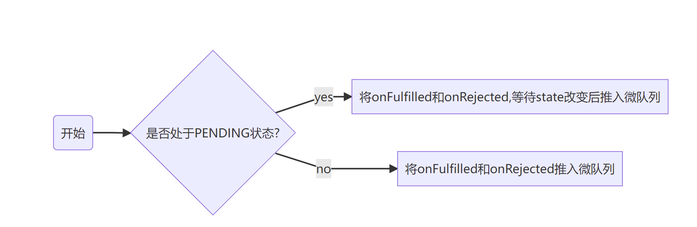

# Promise v0.1

## 传统回调的弊端

回调地狱

```js
function fn3(value, callback) {
  // value = x*x*123...
    callback(value)
}

function fn4(value, callback) {
  // value = x+x+123...
  callback(value)
}

fn1(10000000, function(result1) => {
    fn2(result1, function(result2) => {
        fn3(result2, function(result3) => {
            fn4(result3, function(result4) => {
        ...
                fn100(result99, function(result100) => {
                    console.log(result)
                })
            })
        })
    })
})
```

Promise 的优势：

-   代码可读性更强
-   异步操作的顺序
-   优秀的错误处理
-   第三方异步库引用的信任问题
    -   确定回调不会被过早调用（异步被同步调用等）
    -   确定回调不会被过晚调用或不被调用
    -   回调次数与预期不相符

## Promise A+规范 {#promise}

### 术语

-   **promise**是一个具有`then`方法的对象或函数，且该方法的行为符合本标准
-   **thenable**是一个定义了`then`方法的对象或函数
-   **value**是一个合法的JavaScript值，包括`undefined`，*thenable*和*promise*
-   **exception**是一个使用`throw`关键字抛出的一个`value`
-   **reason**是表明一个`promise`为何被*拒绝*的一个`value`

### 要求

#### Promise 状态

一个*promise*只能处于一下三个状态的其中一种：_pending_, _fulfilled_, _rejected_

-   当处于*pending*状态时
    -   *promise*可能会变成*fulfilled*或者*rejected*中的其中一种
-   当处于*fulfilled*状态时
    -   *promise*不能改变成其它的状态
    -   一定有一个不会改变的*value*
-   当处于*rejected*状态时
    -   *promise*不能改变成其它的状态
    -   一定有一个不会改变的*reason*

#### then 方法

一个*promise*一定要提供一个`then`方法，以访问它当前或者最终的*value*或者*reason*。

*promise*的`then`方法接收两个参数

```js
promise.then(onFulfilled, onRejected)
```

-   `onFulfilled`和`onRejected`都是可选的参数
    -   如果`onFulfilled`不是函数，它将被忽略
    -   如果`onRejected`不是函数，它将被忽略
-   如果`onFulfilled`是一个函数
    -   它一定会在`promise`进入*fulfilled*状态后调用，传入它的第一个参数是`promise`的*value*
    -   它一定不会在`promise`被*fulfilled*之前调用
    -   它不会被调用多次
-   如果`onRejected`是一个函数
    -   它一定会在`promise`进入*rejected*状态后调用，传入它的第一个参数是`promise`的*reason*
    -   它一定不会在`promise`被*rejected*之前调用
    -   它不会被调用多次
-   `onFulfilled`和`onRejected`必须在`then`调用的事件循环伦次之后被异步执行
-   `onFulfilled`和`onRejected`必须被当作函数调用，**并且没有this指针**
-   `then`可能被同一个*promise*多次调用
    -   如果`promise`处于*fulfilled*状态，所有`then`方法中的`onFulfilled`方法会按照顺序全部调用
    -   如果`promise`处于*rejected*状态，所有`then`方法中的`onRejected`方法会按照顺序全部调用
-   `then`方法必须返回一个promise

    ```js
    const promise2 = promise1.then(onFulfilled, onRejected)
    ```

    -   如果`onFulfilled`或`onRejected`返回了一个*value*=`x`，将执行方法**Promise Resolution Procedure**判断`promise2`和`x`
    -   如果`onFulfilled`或`onRejected`抛出了一个异常`e`，返回的`promise2`是一个*rejected*状态并且*reason*=`e`的*promise*
    -   如果当`promise1`进入*fulfilled*时`onFulfilled`不是函数，`promise2`将会是一个*fulfilled*状态且`value`与`promise1`相同
    -   如果当`promise1`进入*rejected*时`onRejected`不是函数，`promise2`将会是一个*rejected*状态且`reason`与`promise1`相同

#### Promise Resolution Procedure

`Promise Resolution Procedure`是一个接收一个`promise`和一个值`x`的抽象操作，

-   如果`promise`和`x`是同一个对象，拒绝这个`promise`，`reason`为`TypeError`
-   如果`x`是一个promise对象，继承其状态
    -   如果`x`是*pending*状态，`promise`会一直处于`pending`直到`x`被*fulfilled*或*rejected*
    -   如果`x`处于*fulfilled*状态，`promise`会被`fulfilled`并继承`x`的*value*
    -   如果`x`处于*rejected*状态，`promise`会被`rejected`并继承`x`的*reason*
-   如果`x`是一个对象或者方法
    -   让`then`方法变为`x.then`
-   如果`x`不是一个对象或者方法，`promise`会被`fulfilled`，其*value*为`x`

## then 中回调函数的执行时机

```js
const promise = new Promise((resolve, reject) => {
    setTimeout(() => {
        resolve(1)
    }, 1000)
})

const onFulfilled = (res) => {
    console.log(res)
}

promise.then(onFulfilled)
```



`then`会同步将`onFulfilled`和`onRejected`推入`promise`的函数队列中，
如果`promise`的状态为*pending*，则不操作函数队列。
`promise`状态变为*fulfilled*或者*rejected*时，存储队列中的所有`onFulfilled`和`onRejected`将被遍历并根据`promise`状态选择要执行的函数，
该函数的执行会根据规范（此处指[Promise A+](#promise)）在规范逻辑中执行，该逻辑模块会被插入微任务队列。
即**所有回调函数会在promise处于*fulfilled*或*rejected*之后立马被推入微队列中**。

上述例子中，`promise`会在1秒后执行`resolve`函数并进入*fulfilled*状态，此时`promise`会将`onFulfilled`函数推入微队列中。

```js
new Promise((resolve, reject) => {
    console.log("外部promise的同步执行")
    resolve()
})
    .then(() => {
        console.log("外部第一个then")
        return new Promise((resolve, reject) => {
            console.log("内部promise的同步执行")
            resolve()
        })
            .then(() => {
                console.log("内部第一个then")
            })
            .then(() => {
                console.log("内部第二个then")
            })
        return new Promise((resolve, reject) => {
            console.log("内部promise2")
            resolve()
        })
            .then(() => {
                console.log("内部第一个then2")
            })
            .then(() => {
                console.log("内部第二个then2")
            })
    })
    .then(() => {
        console.log("外部第二个then")
    })
```

```js
new Promise((resolve, reject) => {
    console.log("外部promise")
    resolve()
})
    .then(() => {
        console.log("外部第一个then")
        new Promise((resolve, reject) => {
            console.log("内部promise")
            resolve()
        })
            .then(() => {
                console.log("内部第一个then")
                return Promise.resolve()
            })
            .then(() => {
                console.log("内部第二个then")
            })
    })
    .then(() => {
        console.log("外部第二个then")
    })
    .then(() => {
        console.log("外部第三个then")
    })
```

```js
new Promise((resolve, reject) => {
    console.log("外部promise")
    resolve()
})
    .then(() => {
        console.log("外部第一个then")
        new Promise((resolve, reject) => {
            console.log("内部promise")
            resolve()
        })
            .then(() => {
                console.log("内部第一个then")
            })
            .then(() => {
                console.log("内部第二个then")
            })
        return new Promise((resolve, reject) => {
            console.log("内部promise2")
            resolve()
        })
            .then(() => {
                console.log("内部第一个then2")
            })
            .then(() => {
                console.log("内部第二个then2")
            })
    })
    .then(() => {
        console.log("外部第二个then")
    })
```

## Promise.all和Promise.race
