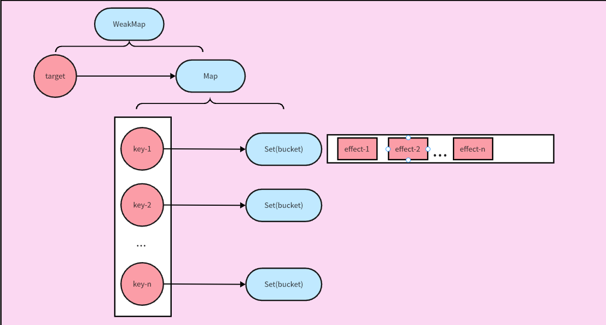
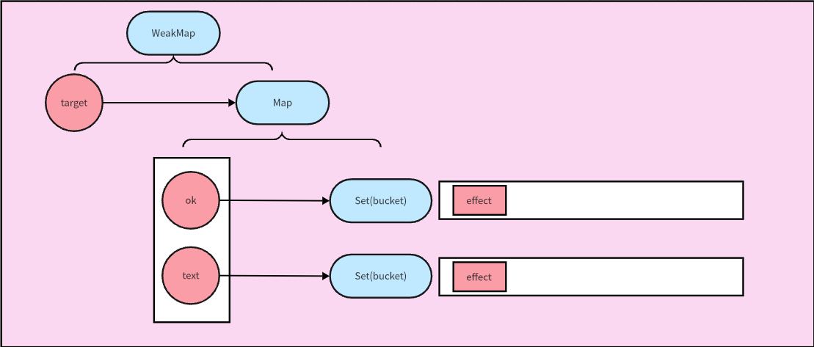
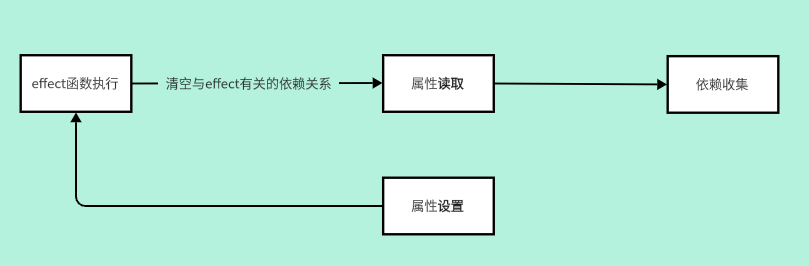
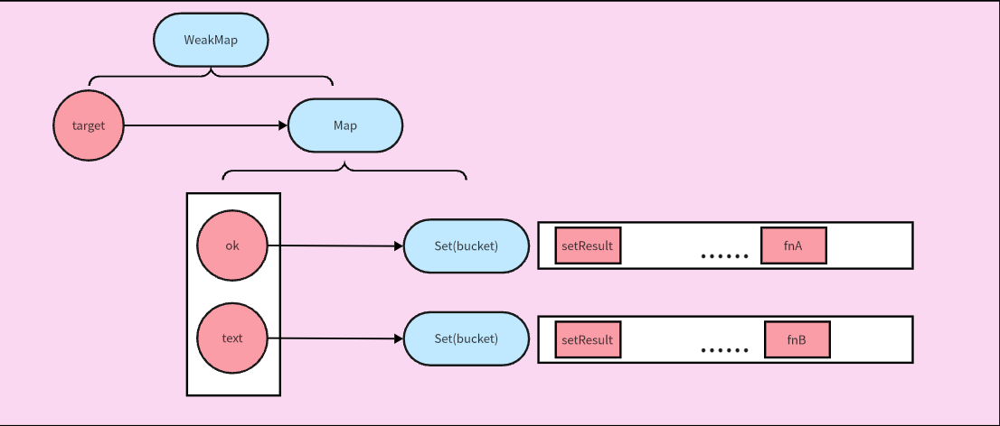
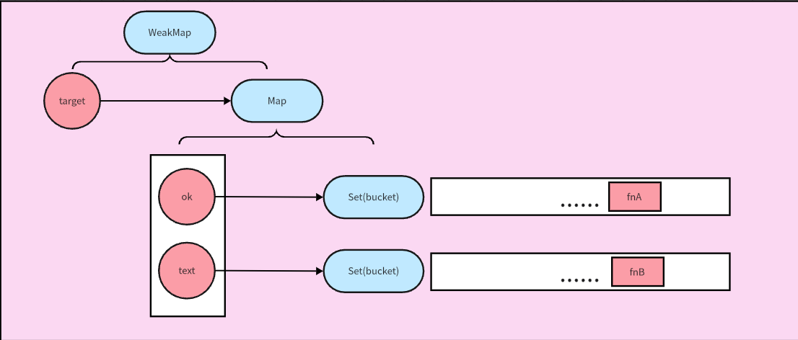
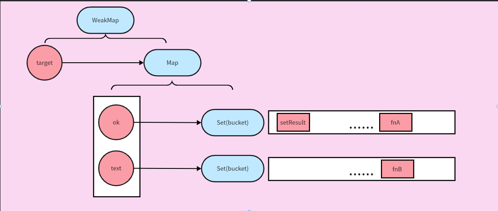

# 响应系统的作用与实现

## 响应式数据与副作用函数

**副作用函数**：指会产生副作用的函数，该函数中运行的内容可能会直接或间接影响其它函数的执行。
比如在函数中修改了外层作用域的变量：

```js
function effect() {
    document.body.innerText = "hello world"
}
```

假设我们在某一个副作用函数中读取了某个对象的属性：

```js
const obj = { text: "hello world" }
function effect() {
    document.body.innerText = obj.text
}
```

上述代码中，函数`effect`会将`body`元素的`innerText`属性设置为`obj.text`。
当`obj.text`发生变化时，会修改真实DOM，在下一个渲染周期后，页面上的数据将发生变化。
如果`obj.text`的值发生了变化，
我们希望副作用函数`effect`能够自动重新执行：

```js
obj.text = "hello"
```

那么此时称`obj`是**响应式数据**——当其修改的时候，能够触发一系列副作用函数的执行。其属性值在副作用函数中与
DOM元素绑定时，就能够响应式地渲染页面：这种情况下，对象属性的修改能够自动触发页面的更新。

目前而言，就上面的代码来说，我们还无法实现这一点。

## 响应式数据的基本实现

通过上一节的描述，我们能找到一些线索：

-   当副作用函数`effect`执行时，会触发`obj.text`的**读取**操作
-   当修改`obj.text`时，会触发`obj.text`的**设置**操作

如果在副作用函数调用时，能够将副作用函数存入一个桶中；当`obj.text`被设置时，
再将桶中的函数取出一一执行。

vue3中采用proxy api实现了这一点，根据上述思路，我们可以简单实现这个响应式变量

```js
const bucket = new Set()

const data = { text: "hello world" }
const obj = new Proxy(data, {
    get(target, key) {
        bucket.add(effect)
        return target[key]
    },
    set(target, key, newValue) {
        target[key] = newValue
        bucket.forEach((effect) => effect())
        return true
    },
})
```

使用这种方法我们能够得到自己想要的结果

```js
let sub = ""
function effect() {
    sub = obj.text
}
effect() // 触发读取，将effect添加到bucket中
setTimeout(() => {
    obj.text = "hello"
    console.log(sub) // hello
}, 1000)
```

## 实现完善的响应式系统

可以看出，一个完整的响应系统的工作流程如下

-   当**读取**触发时，将副作用函数收集到桶中
-   当**设置**触发时，将桶中的副作用函数取出执行

首先我们应该解决硬编码的问题，来适应动态函数名和匿名函数

```js
let activeEffect
// 注册函数
function effect(fn) {
    activeEffect = fn
    fn() // 执行触发get函数
}

// 注册一个匿名函数为activeEffect，
effect(() => {
    document.body.innerText = obj.text
})

const obj = new Proxy(data, {
    get(target, key) {
        if (activeEffect) {
            bucket.add(activeEffect)
        }
        return target[key]
    },
    set(target, key, newValue) {
        target[key] = newValue
        bucket.forEach((effect) => effect())
        return true
    },
})
```

使用一个注册函数来对`activeEffect`进行注册，这样添加副作用函数时就不用依赖原函数的名字了。

此时的响应式系统还存在一个致命的问题————我们只知道副作用函数触发了**读取**操作，却没有将副作用函数与
触发读取操作的对象的属性对应起来。当我们设置对象上任何属性甚至设置不存在的属性都会触发**读取**操作，这并不是我们期望的。
我们期望，**对象的属性字段与副作用函数之间形成映射关系**，保证只有在该属性被设置时会触发对应的副作用函数。

为此我们设计了以下数据结构来完成上述的需求



其中WeakMap用来维护对`target`对象的弱引用，当`target`对象没有被任何地方引用时，不会影响垃圾回收将其从内存中清除，能够避免内存泄漏。
Map维护了每一个键和依赖其的副作用函数的集合，每一个键的读取和设置都只和与其依赖的副作用函数发生作用。

```js
const bucket = new WeakMap()

const obj = new Proxy(data, {
    get(target, key) {
        track(target, key)
        return target[key]
    },
    set(target, key, newValue) {
        target[key] = newValue
        trigger(target, key)
    },
})

function track(target, key) {
    if (!activeEffect) return

    let depsMap = bucket.get(target)
    // 尚没有任何键和副作用函数存在依赖，创建对象到mapper映射
    if (!depsMap) {
        bucket.set(target, (depsMap = new Map()))
    }

    // 这个键值尚不存在任何依赖其的副作用函数
    let deps = depsMap.get(key)
    if (!deps) {
        depsMap.set(key, (deps = new Set()))
    }

    deps.add(activeEffect)
}

function trigger(target, key) {
    const depsMap = bucket.get(target)
    if (!depsMap) return
    const deps = depsMap.get(key)
    deps && deps.forEach((effect) => effect())
}
```

## 分支切换

我们还得考虑一种情况：副作用函数中存在依赖于对象属性的分支切换，分支切换可能产生遗留的副作用函数。
比如如下代码

```js
const data = { ok: true, text: "hello" }
const obj = new Proxy(data, {
    /**... */
})
let result = ""

effect(() => {
    result = obj.ok ? obj.text : "not"
})
```

当`ojb.ok`为`true`时，在副作用函数中会读取`ok`和`text`字段，所以这个副作用函数在这两个字段中都会被收集。



如果在此之后，`obj.ok`的值被修改为`false`，并触发副作用函数执行时，由于此时`false`屏蔽了`text`字段的读取，所以**理想
情况下**此时副作用函数不应该被`text`字段收集：


但是按照前面的实现我们还做不到这一点，当副作用函数被`text`字段收集后，即使在后续并不会进入到`text`字段的读取上，它也依然会
存在`text`所收集的依赖集合中。

```js
effect(() => {
    result = obj.ok ? obj.text : "not"
})

console.log(result) // hello
console.log(bucket.get(data)) // Map(2) { 'ok' => Set(1) {Function}, 'text' => Set(1) {Function}}
obj.ok = false
console.log(result) // not
console.log(bucket.get(data)) // Map(2) { 'ok' => Set(1) {Function}, 'text' => Set(1) {Function}}
```

所以我们期望，在`ok`的值为`false`时，无论`obj.text`的值如何改变，都不需要重新执行副作用函数。但事实上目前而言，
对`obj.text`的修改依然会触发副作用函数的执行，即使它根本无法产生我们想要的副作用。

```js
obj.text = "hello world"
console.log(result) // not
```

我们发现问题出现在这一句`obj.ok = false`，在这一句之后，我们知道，`obj.text`在副作用函数中不会被访问到。因此，
当`obj.ok = false`执行时我们应该重新对副作用函数进行一次依赖收集，来确定这一次**设置**导致的变化会影响哪些其它的
字段和副作用函数的依赖关系。

简单的做法是，`obj.ok = false`执行调用`trigger`后，在副作用函数执行时，清空所有字段的依赖集合与这个副作用函数之间的依赖的关系。
由于副作用函数的执行会对副作用函数中的字段进行**读取**操作，因此最后会对副作用函数中引用到的字段重新进行依赖收集。这样就可以在`obj.ok = false`设置时，
让`obj.text`字段不对该副作用函数进行依赖收集。



我们将副作用函数声明为有名的函数，方便使用图例来理解这个行为

```js
function setResult() {
    res = obj.ok ? obj.text : "not"
}
```

当`obj.ok`为`true`时，进行依赖收集，在`setResult`调用时，`ok`字段和`text`字段都触发了对应读取操作，将`setResult`进行收集。



此时执行`obj.ok = false`，触发`obj`的设置操作，在真正执行副作用函数之前，将副作用函数与字段之间的依赖关系清空。



执行副作用函数，副作用函数中读取过的字段会将`activeEffect`收集，此时由于副作用函数中无法读取到`text`字段，因此它不会收集`setResult`函数。



我们可以通过修改`effect`函数，在副作用函数设置一个数组用，**用来存储收集了自己的依赖集合**。
比如，在`obj.ok`为`true`时，这个数组同时收集了`ok`字段和`text`字段所对应的依赖集。

```js
function effect(fn){
    const effectFn = () ={
        activeEffect = effectFn
        cleanup(effectFn) // 在后续实现
        fn() // 这一步会重新进行effecFn的依赖收集
    }
    effectFn.deps = []
    effectFn()
}
```

每当一个字段被设置，在`track`函数中，就为当前的`activeEffect`的`deps`属性添加上这个字段的依赖集的引用。

```js
function track(target, key) {
    if (!activeEffect) return

    let depsMap = bucket.get(target)
    // 尚没有任何键和副作用函数存在依赖，创建对象到mapper映射
    if (!depsMap) {
        bucket.set(target, (depsMap = new Map()))
    }

    // 这个键值尚不存在任何依赖其的副作用函数
    let deps = depsMap.get(key)
    if (!deps) {
        depsMap.set(key, (deps = new Set()))
    }

    deps.add(activeEffect)
    activeEffect.deps.push(deps) // 新增
}
```

在属性值被设置时，触发`cleanup`函数先清空所有该副作用函数与字段之间的依赖关系。

```js
function cleanup(effectFn) {
    for (let i = 0; i < effectFn.deps.length; i++) {
        const deps = effectFn.deps[i]
        deps.delete(efffectFn) // 将所有字段收集到的该副作用函数移除，之后在副作用函数执行时重新设置依赖
    }
    // 将副作用函数对应的字段清空
    effectFn.deps.length = 0
}
```

上面的代码还会存在死循环的问题，因为`ok`在删除依赖后又会添加，相当于执行如下代码：

```js
const set = new Set([1])

set.forEach((item) => {
    set.delete(1)
    set.add(1)
})
```

原因在于`Set.prototype.forEach`的机制，为了避免这种情况的发生，在`trigger`中使用新的集合来遍历即可。

```js
function trigger(target, key) {
    const depsMap = bucket.get(target)
    if (!depsMap) return
    const effects = depsMap.get(key)

    const effectsToRun = new Set(effects) // 使用新的
    effectsToRun.forEach((effectFn) => effectFn())
}
```

这个小节讨论的核心内容是：
